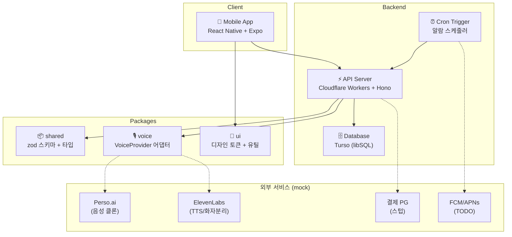

# VoiceAlarm

소중한 사람의 음성을 클론하여 알람/응원 메시지를 보내주는 앱.

통화 녹음 → 화자 분리 → 음성 클론 → TTS → 알람/푸시

## 아키텍처



## 모노레포 구조

```
voice_alarm/
├── apps/
│   └── mobile/        React Native (Expo) 앱
├── packages/
│   ├── backend/       Cloudflare Workers + Hono API
│   ├── shared/        공용 타입 + zod 스키마
│   ├── voice/         음성 어댑터 (VoiceProvider + Mock)
│   └── ui/            디자인 토큰 + 접근성 유틸
└── docs/              설계 문서 + QA 체크리스트
```

## 기술 스택

| 영역 | 기술 |
|------|------|
| 모바일 | React Native, Expo, expo-router |
| 백엔드 | Cloudflare Workers, Hono, Turso (LibSQL) |
| 음성 AI | Perso.ai (1차), ElevenLabs (보조) |
| 인증 | Google OAuth, Apple Sign-In |
| 결제 | RevenueCat (예정) |

## 시작하기

### 환경변수

`.env.example` 을 참고하여 `.env` 파일을 생성한다.

```
PERSO_API_KEY=          # Perso.ai 음성 API
ELEVENLABS_API_KEY=     # ElevenLabs TTS API
GOOGLE_CLIENT_ID=       # Google OAuth
TURSO_DATABASE_URL=     # Turso DB URL
TURSO_AUTH_TOKEN=       # Turso 인증 토큰
```

백엔드 Workers 환경변수는 `packages/backend/.dev.vars` 에 설정한다.

### 의존성 설치

```bash
npm install
```

### 개발 서버

```bash
# 백엔드 (Wrangler dev server, localhost:8787)
npm run backend

# 모바일 앱 (Expo)
npm run app
```

### 타입 체크

```bash
cd packages/backend && npx tsc --noEmit
cd apps/mobile && npx tsc --noEmit
```

## 배포

GitHub Actions가 `develop` / `main` 브랜치 push 시 자동 배포한다.

| 대상 | 트리거 경로 | 배포 위치 |
|------|-----------|----------|
| 백엔드 | `packages/backend/**` | Cloudflare Workers |
| CI (typecheck) | 전체 | ubuntu-latest matrix |

배포 후 DB 초기화가 필요하면 `GET /api/init-db` 를 호출한다.

### 배포 URL

- 백엔드 API: `https://voice-alarm-api.voicealarm.workers.dev`
- 모바일 앱: 미배포 (EAS Build)

## API 엔드포인트

모든 API는 `/api` 프리픽스를 사용하며, `Authorization: Bearer <token>` 헤더가 필요하다.

| 그룹 | 주요 엔드포인트 |
|------|---------------|
| 사용자 | `GET /user/me`, `PATCH /user/plan` |
| 음성 | `GET /voice`, `POST /voice/clone`, `POST /voice/diarize` |
| TTS | `POST /tts/generate`, `GET /tts/messages`, `GET /tts/presets` |
| 알람 | `GET /alarm`, `POST /alarm`, `PATCH /alarm/:id` |
| 친구 | `POST /friend`, `GET /friend/list`, `PATCH /friend/:id/accept` |
| 선물 | `POST /gift`, `GET /gift/received`, `PATCH /gift/:id/accept` |
| 라이브러리 | `GET /library`, `PATCH /library/:id/favorite` |

상세 API 테스트 시나리오는 [`docs/E2E_SCENARIO_GUIDE.md`](docs/E2E_SCENARIO_GUIDE.md) 참고.

## 핵심 기능

- **음성 클론**: 오디오 파일 업로드 → 화자 분리 → AI 음성 프로필 생성
- **TTS 메시지**: 클론된 음성으로 텍스트를 음성 메시지로 변환
- **알람**: 음성 메시지를 알람으로 설정 (반복, 스누즈)
- **친구 시스템**: 이메일 기반 친구 추가 (양방향 수락)
- **선물하기**: 만든 음성 메시지를 친구에게 선물
- **상호 알람**: 친구에게 알람을 설정해줄 수 있음

## 브랜치 전략

- `main` ← `develop` ← 이슈 브랜치
- `develop`에 push → 자동 배포
- `main`은 수동 머지 (리뷰 후)

## 라이선스

Private
